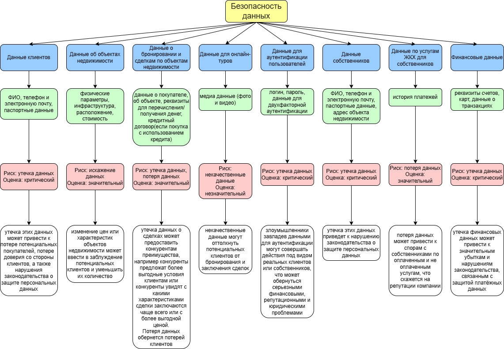
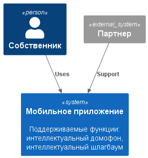
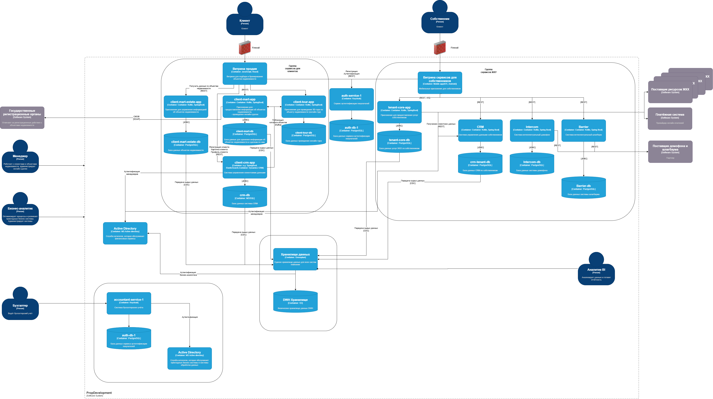

# architecture-propdevelopment

## Task1
Исходник mindmap по Безопасности данных: [здесь](Task1/sprint7_task1.drawio)

## Task2
Проверочный лист: [здесь](Task2/IB.md)

## Task3
Диаграмма контекста:

Исходник диаграммы контейнеров: [здесь](Task3/PropDevelopment_С4_model.drawio.xml)

## требования:
### требования к безопасности
 - хранение биометрических данных и номеров в зашифрованном виде (AES)
 - коммуникация с партнером при помощи безопасного соединения (TLS не ниже 1.2)
 - журналирование действий и их аудит
 - настройка алертинга для подозрительных действий

### протоколы аутентификации и авторизации
протокол аутентификации и авторизации OAuth 2.0 с включенным MFA. Keycloac,который уже используется в системе поддерживает OAuth 2.0.

### описание взаимодействия между системами предприятия и внешней платформой
- можно предоставить свой API для ивентов, чтобы реализовать через Webhook API (если партнер поддерживает), либо вызывать с какой-то частотой API, который предоставил партнер (pull)

## Task4
Таблица: [здесь](Task4/таблица.md)

Пользователи: [здесь](Task4/users.yaml)

Роли: [здесь](Task4/roles.yaml)

Биндинги: [здесь](Task4/bindings.yaml)

## Task5
[admin-api-allow-back-to-front.yaml](Task5/admin-api-allow-back-to-front.yaml)

[admin-api-allow-front-to-back.yaml](Task5/admin-api-allow-front-to-back.yaml)

[non-admin-api-allow-back-to-front.yaml](Task5/non-admin-api-allow-back-to-front.yaml)

[non-admin-api-allow-front-to-back.yaml](Task5/non-admin-api-allow-front-to-back.yaml)